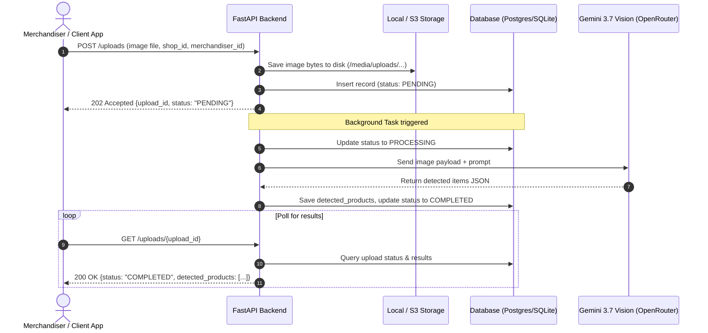

# Prism — PRAN-RFL Rack Recognition API Documentation

Comprehensive API documentation for the **PRAN-RFL Rack Recognition System** backend service.

---

## 1. Overview & Base URLs

The Prism API processes shelf and rack photos taken by retail merchandisers, identifying PRAN-RFL product SKUs and calculating visible unit quantities using Google Gemini 3.7 Flash vision models.

| Environment | Base URL | Notes |
|---|---|---|
| **Local (SQLite)** | `http://localhost:8000` | Default dev environment |
| **Docker Compose** | `http://localhost:8000` | Backend with PostgreSQL 16 |
| **Interactive Swagger UI** | `http://localhost:8000/docs` | Live testing & OpenAPI spec |
| **ReDoc UI** | `http://localhost:8000/redoc` | Formatted API reference |
| **Web Dashboard** | `http://localhost:8000/` or `/ui` | Full graphical test UI & history |

---

## 2. Processing Lifecycle



---

## 3. Endpoints Reference

### 3.1. System & Health

#### `GET /health`
Liveness probe to verify server availability.

- **URL:** `/health`
- **Method:** `GET`
- **Authentication:** None

**Example Request:**
```bash
curl -X GET http://localhost:8000/health
```

**Response `200 OK`:**
```json
{
  "status": "ok"
}
```

---

### 3.2. Rack Uploads & Analysis

#### `POST /uploads`
Uploads a rack image and enqueues a background AI recognition job.

- **URL:** `/uploads`
- **Method:** `POST`
- **Content-Type:** `multipart/form-data`

**Form Parameters:**

| Parameter | Type | Required | Description |
|---|---|---|---|
| `file` | Binary File | **Yes** | Image file (`image/jpeg`, `image/png`, `image/webp`). Max size: 10 MB. |
| `shop_id` | String | No | Unique shop identifier (e.g. `SHOP-Gulshan-102`). |
| `merchandiser_id` | String | No | Merchandiser identifier or name (e.g. `MER-Rahim-45`). |

**Example Request (cURL):**
```bash
curl -X POST http://localhost:8000/uploads \
  -F "file=@/path/to/rack_shelf.jpg" \
  -F "shop_id=SHOP-102" \
  -F "merchandiser_id=MER-45"
```

**Response `202 Accepted`:**
```json
{
  "upload_id": "f0051207-7e9f-4f5d-a8a1-8b1fed212103",
  "status": "PENDING",
  "message": "Image received. Processing started."
}
```

**Error Responses:**
- `400 Bad Request`: Invalid file type or file size exceeds limit (10 MB).
- `500 Internal Server Error`: Failed to write image to disk storage.

---

#### `POST /uploads/url`
Accepts a publicly accessible rack image URL, downloads and validates the image, and enqueues a background AI recognition job.

- **URL:** `/uploads/url`
- **Method:** `POST`
- **Content-Type:** `application/json`

**JSON Request Body:**

| Field | Type | Required | Description |
|---|---|---|---|
| `image_url` | String | **Yes** | Publicly accessible HTTP/HTTPS image URL (`JPEG`, `PNG`, `WebP`). Max size: 10 MB. |
| `shop_id` | String | No | Unique shop identifier (e.g. `SHOP-Gulshan-102`). |
| `merchandiser_id` | String | No | Merchandiser identifier or name (e.g. `MER-Rahim-45`). |

**Example Request (cURL):**
```bash
curl -X POST http://localhost:8000/uploads/url \
  -H "Content-Type: application/json" \
  -d '{
    "image_url": "https://example.com/rack_shelf.jpg",
    "shop_id": "SHOP-102",
    "merchandiser_id": "MER-45"
  }'
```

**Response `202 Accepted`:**
```json
{
  "upload_id": "f0051207-7e9f-4f5d-a8a1-8b1fed212103",
  "status": "PENDING",
  "message": "Image URL received. Processing started."
}
```

**Error Responses:**
- `400 Bad Request`: Invalid URL scheme (only HTTP/HTTPS supported), image unreachable, invalid image type, or file size exceeds limit (10 MB).
- `500 Internal Server Error`: Failed to save downloaded image to disk storage.

---

#### `GET /uploads/{upload_id}` or `GET /uploads/{upload_id}/result`
Retrieves the status and detected products for a specific upload.

- **URL:** `/uploads/{upload_id}` or `/uploads/{upload_id}/result`
- **Method:** `GET`
- **Path Parameters:**
  - `upload_id` (UUID string, required)

**Example Request:**
```bash
curl -X GET http://localhost:8000/uploads/f0051207-7e9f-4f5d-a8a1-8b1fed212103
```

**Response `200 OK` (Processing in progress):**
```json
{
  "upload_id": "f0051207-7e9f-4f5d-a8a1-8b1fed212103",
  "status": "PROCESSING",
  "shop_id": "SHOP-102",
  "merchandiser_id": "MER-45",
  "image_url": "http://localhost:8000/media/uploads/SHOP-102/ab62985150b840a480a575b828fb1c49.jpg",
  "detected_products": null,
  "error_message": null,
  "created_at": "2026-08-31T11:15:00Z",
  "updated_at": "2026-08-31T11:15:02Z"
}
```

**Response `200 OK` (Completed with detections):**
```json
{
  "upload_id": "f0051207-7e9f-4f5d-a8a1-8b1fed212103",
  "status": "COMPLETED",
  "shop_id": "SHOP-102",
  "merchandiser_id": "MER-45",
  "image_url": "http://localhost:8000/media/uploads/SHOP-102/ab62985150b840a480a575b828fb1c49.jpg",
  "detected_products": [
    {
      "product_name": "PRAN Mango Juice 250ml",
      "quantity_visible": 6
    },
    {
      "product_name": "PRAN Lassi 200ml",
      "quantity_visible": 4
    },
    {
      "product_name": "RFL Water Bottle 1L",
      "quantity_visible": 2
    }
  ],
  "error_message": null,
  "created_at": "2026-08-31T11:15:00Z",
  "updated_at": "2026-08-31T11:15:06Z"
}
```

**Response `200 OK` (Failed):**
```json
{
  "upload_id": "f0051207-7e9f-4f5d-a8a1-8b1fed212103",
  "status": "FAILED",
  "shop_id": "SHOP-102",
  "merchandiser_id": "MER-45",
  "image_url": "http://localhost:8000/media/uploads/SHOP-102/ab62985150b840a480a575b828fb1c49.jpg",
  "detected_products": null,
  "error_message": "OpenRouter API error 401: Invalid API Key",
  "created_at": "2026-08-31T11:15:00Z",
  "updated_at": "2026-08-31T11:15:03Z"
}
```

**Error Responses:**
- `404 Not Found`: Upload ID does not exist in the database.

---

#### `GET /uploads` (Aliases: `GET /analysis`, `GET /results`)
Returns a paginated list of analysis records with search and filter capabilities.

- **URL:** `/uploads`
- **Method:** `GET`

**Query Parameters:**

| Parameter | Type | Default | Description |
|---|---|---|---|
| `status` | String | `null` | Filter by status: `PENDING`, `PROCESSING`, `COMPLETED`, `FAILED` |
| `shop_id` | String | `null` | Filter by shop identifier (case-insensitive substring) |
| `merchandiser_id` | String | `null` | Filter by merchandiser identifier (case-insensitive substring) |
| `search` | String | `null` | Keyword search across shop ID, merchandiser ID, upload ID, errors |
| `limit` | Integer | `50` | Maximum number of records (1 to 100) |
| `offset` | Integer | `0` | Starting record offset for pagination |

**Example Request:**
```bash
curl -X GET "http://localhost:8000/uploads?status=COMPLETED&shop_id=SHOP-102&limit=20&offset=0"
```

**Response `200 OK`:**
```json
{
  "total": 1,
  "limit": 20,
  "offset": 0,
  "items": [
    {
      "upload_id": "f0051207-7e9f-4f5d-a8a1-8b1fed212103",
      "status": "COMPLETED",
      "shop_id": "SHOP-102",
      "merchandiser_id": "MER-45",
      "image_url": "http://localhost:8000/media/uploads/SHOP-102/ab62985150b840a480a575b828fb1c49.jpg",
      "detected_products": [
        {
          "product_name": "PRAN Mango Juice 250ml",
          "quantity_visible": 6
        }
      ],
      "error_message": null,
      "created_at": "2026-08-31T11:15:00Z",
      "updated_at": "2026-08-31T11:15:06Z"
    }
  ]
}
```

---

#### `GET /uploads/summary` (Alias: `GET /analysis/summary`)
Returns aggregated metrics and top detected PRAN-RFL products across all historical scans.

- **URL:** `/uploads/summary`
- **Method:** `GET`

**Example Request:**
```bash
curl -X GET http://localhost:8000/uploads/summary
```

**Response `200 OK`:**
```json
{
  "total_scans": 48,
  "completed_scans": 45,
  "processing_scans": 1,
  "pending_scans": 0,
  "failed_scans": 2,
  "total_products_detected": 312,
  "unique_products_count": 24,
  "top_products": [
    {
      "product_name": "PRAN Mango Juice 250ml",
      "total_quantity": 84,
      "scan_appearances": 28
    },
    {
      "product_name": "PRAN Frooto 250ml",
      "total_quantity": 62,
      "scan_appearances": 21
    },
    {
      "product_name": "RFL Click Water Bottle 1L",
      "total_quantity": 38,
      "scan_appearances": 15
    }
  ],
  "recent_uploads": [
    {
      "upload_id": "f0051207-7e9f-4f5d-a8a1-8b1fed212103",
      "status": "COMPLETED",
      "shop_id": "SHOP-102",
      "merchandiser_id": "MER-45",
      "image_url": "http://localhost:8000/media/uploads/SHOP-102/ab62985150b840a480a575b828fb1c49.jpg",
      "detected_products": [...],
      "error_message": null,
      "created_at": "2026-08-31T11:15:00Z",
      "updated_at": "2026-08-31T11:15:06Z"
    }
  ]
}
```

---

#### `DELETE /uploads/{upload_id}`
Permanently deletes an upload record from the database and removes the saved image file from disk.

- **URL:** `/uploads/{upload_id}`
- **Method:** `DELETE`

**Example Request:**
```bash
curl -X DELETE http://localhost:8000/uploads/f0051207-7e9f-4f5d-a8a1-8b1fed212103
```

**Response `200 OK`:**
```json
{
  "upload_id": "f0051207-7e9f-4f5d-a8a1-8b1fed212103",
  "message": "Upload 'f0051207-7e9f-4f5d-a8a1-8b1fed212103' and associated media deleted successfully."
}
```

**Error Responses:**
- `404 Not Found`: Upload ID not found.

---

### 3.3. Static Media Access

#### `GET /media/{image_key}`
Serves uploaded images as static content.

- **URL:** `/media/uploads/{shop_id}/{filename}.{ext}`
- **Method:** `GET`
- **Response:** Raw binary image stream (`image/jpeg`, `image/png`, `image/webp`).

---

## 4. Client Integration Examples

### 4.1. JavaScript (Fetch API with Polling)

```javascript
async function uploadAndGetResults(file, shopId, merchId) {
  const API_BASE = "http://localhost:8000";

  // 1. Upload the image
  const formData = new FormData();
  formData.append("file", file);
  if (shopId) formData.append("shop_id", shopId);
  if (merchId) formData.append("merchandiser_id", merchId);

  const uploadRes = await fetch(`${API_BASE}/uploads`, {
    method: "POST",
    body: formData,
  });

  if (!uploadRes.ok) {
    throw new Error(`Upload error: ${await uploadRes.text()}`);
  }

  const { upload_id } = await uploadRes.json();
  console.log(`Uploaded successfully. Tracking ID: ${upload_id}`);

  // 2. Poll for the analysis result
  while (true) {
    await new Promise((resolve) => setTimeout(resolve, 1500));

    const pollRes = await fetch(`${API_BASE}/uploads/${upload_id}`);
    const data = await pollRes.json();

    if (data.status === "COMPLETED") {
      console.log("Analysis Completed!", data.detected_products);
      return data;
    } else if (data.status === "FAILED") {
      throw new Error(`Analysis failed: ${data.error_message}`);
    }
    console.log(`Status: ${data.status}... waiting`);
  }
}
```

---

### 4.2. Python (`requests` SDK)

```python
import time
import requests

API_BASE = "http://localhost:8000"

def analyze_rack(image_path: str, shop_id: str = None, merchandiser_id: str = None):
    # 1. POST upload
    with open(image_path, "rb") as f:
        files = {"file": f}
        data = {}
        if shop_id:
            data["shop_id"] = shop_id
        if merchandiser_id:
            data["merchandiser_id"] = merchandiser_id

        res = requests.post(f"{API_BASE}/uploads", files=files, data=data)
        res.raise_for_status()
        upload_id = res.json()["upload_id"]

    print(f"Uploaded. Upload ID: {upload_id}")

    # 2. Poll until completed or failed
    while True:
        time.sleep(1.5)
        poll_res = requests.get(f"{API_BASE}/uploads/{upload_id}")
        poll_res.raise_for_status()
        result = poll_res.json()

        status = result["status"]
        if status == "COMPLETED":
            print("Detected products:")
            for p in result["detected_products"]:
                print(f"- {p['product_name']}: {p['quantity_visible']} units")
            return result
        elif status == "FAILED":
            raise RuntimeError(f"Analysis failed: {result['error_message']}")

        print(f"Status: {status}...")

if __name__ == "__main__":
    analyze_rack("rack_photo.jpg", shop_id="SHOP-102", merchandiser_id="MER-45")
```

---

## 5. Status Codes & Error Formats

| HTTP Code | Description | Example Trigger |
|---|---|---|
| `200 OK` | Request succeeded | Fetching result, listing uploads, summary |
| `202 Accepted` | Async job accepted | Initial rack upload (`POST /uploads`) |
| `400 Bad Request` | Invalid client payload | Unsupported MIME type, file > 10 MB |
| `404 Not Found` | Resource not found | Invalid `upload_id` |
| `422 Unprocessable` | Validation error | Missing required form field `file` |
| `500 Server Error` | Storage or server error | Disk write failure |

All error responses return standard JSON:
```json
{
  "detail": "Description of the error"
}
```
